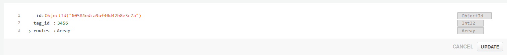

# Embedded Project

## User Guide

## MongoDB set up

MongoDb:
MongoDb is a source-available cross-platform documented-oriented database program. 

Create and manage the unified mongoDB account services like MongoDB Atlas
Access the MongoDb Service
Manage Information.

Procedure: <br>
Step 1: <br>
Create MongoDB account go to  https://www.mongodb.com/atlas-signup-from-mlab. You must provide the following information to register for a new account in MongoDB.<br>
Provide the following information about yourself:
* Company (Optional)
* How you are using MongoDB
* Email Address
* First Name and Last Name
* Password <br>
Or you can sign up using your aalto Gmail account. <br>

Step 2: <br>
* Login in MongDB Atlas
* Click on your cluster
* Go to Collections
* Click create database and For Database type FinTour and collection name User
* Then on FinTour database tab create the following collections: <br>
    * Users
    * Tags

    * Stops
    * Ships <br>

Step 3: <br> 
In tags collection insert a document then add a Int32 variable with name tag_id of your choice. <br>
<p align="center"></p>

## Setting up the Web server
Step 1: <br>
Clone the repo <br>
Step 2: <br>
Check python version python 3.6+ should be installed. <br>
Step3: <br>
Set up the development environment
```
# Python 3.6+
python -m virtualenv embedded-project

# Activate the virtualenv (Linux)
source embedded-project/bin/activate
```
Step 4: <br>
Install the necessary packages 

```
# Python 3.6+
 pip install -r requirements.txt
```
Step 5: <br>
Deploy the server using Gunicorn go to Web-Service folder and run the command below. Make sure you select the correct IP address and port.
```
gunicorn3 -w 1 -b [IP ADDRESS]:[PORT] run:app
```
## Setup Display Control
Step 1: <br>

Set up your Raspberry Pi 3+ operating system by using preinstalled NOOBS sd card or by formatting your own SD card. More detailed instruction can be found from https://www.raspberrypi.org/help/noobs-setup./

Step 2:<br>

Connect the Pimoroni Unicorn Hat HD 16x16 LED matrix to the Raspberry Pi pins.

Step 3: <br>

Install Unicorn Hat HD library. Open a new terminal window in your Raspberry Pi and type:
```
curl https://get.pimoroni.com/unicornhathd | bash
```
Step 3: <br>

Install Pillow:
```
python3 -m pip install --upgrade pip
python3 -m pip install --upgrade Pillow
```
Step 4: <br>
Install Dateutil:
```
pip install python-dateutil
```
Step 5:

Open the display_control.py in text editor and replace the url in the code with the ip address of the server.

```
url = 'http://?.?.?.?'
```
## Test Plan
Step 1: <br>
If you have follwed user maual it is possible to test the Mongo database and server. Download and install Postman.  link: https://www.postman.com/downloads/ <br>
Step 2: <br>
Create workspace and a collection in Postman. <br>
Step 3: <br>
Make a post request to signup. Use the link you server is running and add the link below.
```
http://[IP ADDRESS]:[PORT]/api/auth/signup
```
This is body for the request fill up the field with your info.
```json
{
    "email" : "",
    "password" : "",
	"first_name": "",
	"last_name": "",
	"role": "Leader"
}
```
Press send and you should receive the response with the user MongoDB document ID which the server  will use.

Step 4: <br>
Next make a put request to set current leader tag using the id you received and add the link below.
```
http://[IP ADDRESS]:[PORT]/api/leadertag/[DOCUMENT ID]
```
This is body for the request fill up the field with your tag that is in the database.
```json
{
	"current_tag": 
}
```
Press send
Step 5:
Finally make a post request to add a tour route with the link and body shown below.
```
http://[IP ADDRESS]:[PORT]/api/tag/[TAG ID]
```
Body
```json
{
	"origin": "Haima",
	"destination": "Aland",
	"departure_time": "2020-11-09 T 11:20",
	"arrival_time": "2020-11-09 T 13:20",
	"tour_status": "Started"
}
```
Press send and if the request is successful the Tag display should show the tour information.


